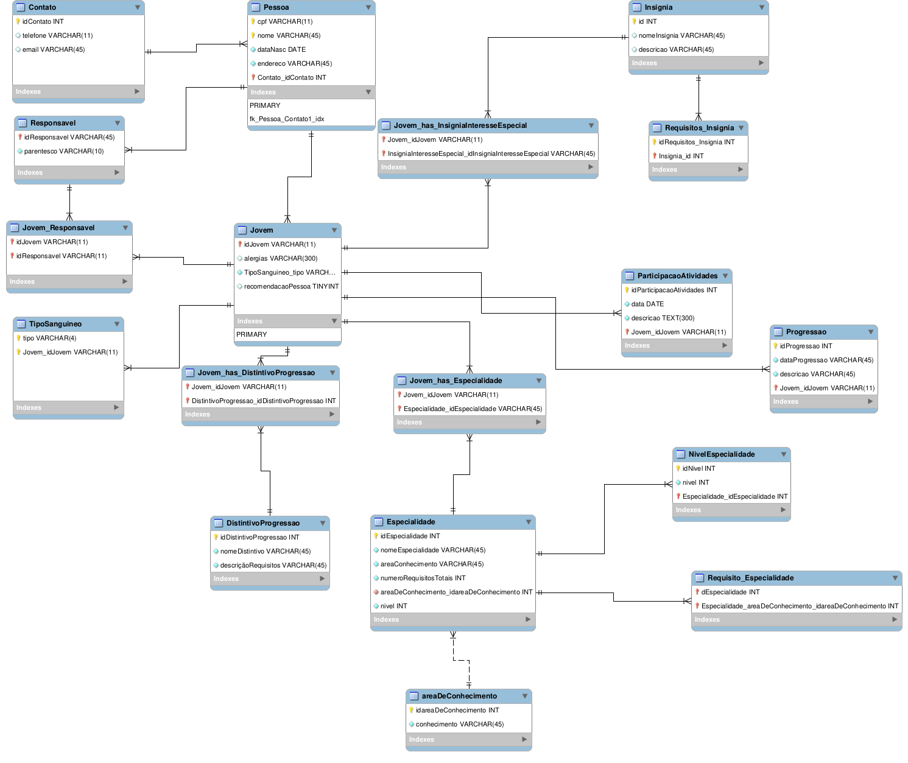

# Banco de Dados do Movimento Escoteiro - Ramo Lobinho

## Estrutura do Banco de Dados

O banco de dados é composto por várias tabelas inter-relacionadas que armazenam os dados necessários para o acompanhamento do desenvolvimento dos jovens. Abaixo está uma breve descrição das tabelas principais:

### Tabelas Principais

1. **Pessoa**
   - Armazena informações biográficas dos indivíduos, como CPF, nome, data de nascimento e endereço.

2. **Contato**
   - Armazena informações de contato, como telefone e e-mail, e é referenciada pela tabela Pessoa.

3. **Jovem**
   - Contém informações específicas dos jovens, como alergias, tipo sanguíneo e recomendações.

4. **TipoSanguineo**
   - Lista os tipos sanguíneos e é relacionada com a tabela Jovem para registrar o tipo sanguíneo de cada jovem.

5. **Responsavel**
   - Armazena informações dos responsáveis pelos jovens, incluindo o grau de parentesco.

6. **Jovem_Responsavel**
   - Relaciona os jovens com seus respectivos responsáveis.

7. **ParticipacaoAtividades**
   - Registra a participação dos jovens em diversas atividades, incluindo a data e uma descrição da atividade.

8. **Progressao**
   - Contém registros das progressões dos jovens, com data e descrição.

9. **AreaDeConhecimento**
   - Define as áreas de conhecimento relacionadas às especialidades.

10. **Especialidade**
    - Armazena informações sobre as especialidades que os jovens podem conquistar.

11. **NivelEspecialidade**
    - Define os níveis de especialidade alcançados pelos jovens com base nos requisitos cumpridos.

12. **Insignia**
    - Armazena as insígnias que os jovens podem conquistar por meio do cumprimento de requisitos específicos.

13. **DistintivoProgressao**
    - Registra os distintivos de progressão dos jovens.

14. **Requisitos_Insignia**
    - Define os requisitos que precisam ser cumpridos para a obtenção de insígnias.

15. **Requisito_Especialidade**
    - Define os requisitos necessários para a obtenção das especialidades.

### Relacionamentos

- **Pessoa** e **Contato**: Relacionamento 1:N, onde uma pessoa pode ter um contato associado.
- **Jovem** e **TipoSanguineo**: Relacionamento 1:N, onde um tipo sanguíneo pode estar associado a vários jovens, mas cada jovem tem um único tipo sanguíneo.
- **Jovem** e **Responsavel**: Relacionamento N:N, onde um jovem pode ter vários responsáveis e um responsável pode ser responsável por vários jovens.
- **Jovem** e **ParticipacaoAtividades**: Relacionamento 1:N, onde um jovem pode participar de várias atividades.
- **Jovem** e **Progressao**: Relacionamento 1:N, onde um jovem pode ter várias progressões registradas.
- **Jovem** e **Especialidade**: Relacionamento N:N, onde um jovem pode conquistar várias especialidades e uma especialidade pode ser conquistada por vários jovens.
- **Jovem** e **Insignia**: Relacionamento N:N, onde um jovem pode conquistar várias insígnias de interesse especial.
- **Insignia** e **Requisitos_Insignia**: Relacionamento 1:N, onde uma insígnia pode ter vários requisitos.
